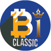

# 

Token TRC20 utility to be distributed among Homeland Community Indonesia.

- Name: HomeBitcoin Classic
- Symbol: WHOMELAND
- Decimal places: 6
- Total supply: Dynamic as tokens are distributed
- [Token link on the mainnet network](https://tronscan.org/#/contract/THTnqCnGJuoRdn9FjQyG746xVWgpaKbtcc)

### Overview

The WHOMELAND Token will be created in order to be distributed to Homeland Community Indonesia. In other words, all those who collaborate should receive their tokens for each approved activity.

### How to purchase and view

- You can acquire WHOMELAND tokens by performing the activities that are in the Homeland Community Indonesia.

[Access our website and click on I want to participate.](https://homelandcommunityindonesia.com/)
Questions or Suggestions?

Get in touch and let's talk.

